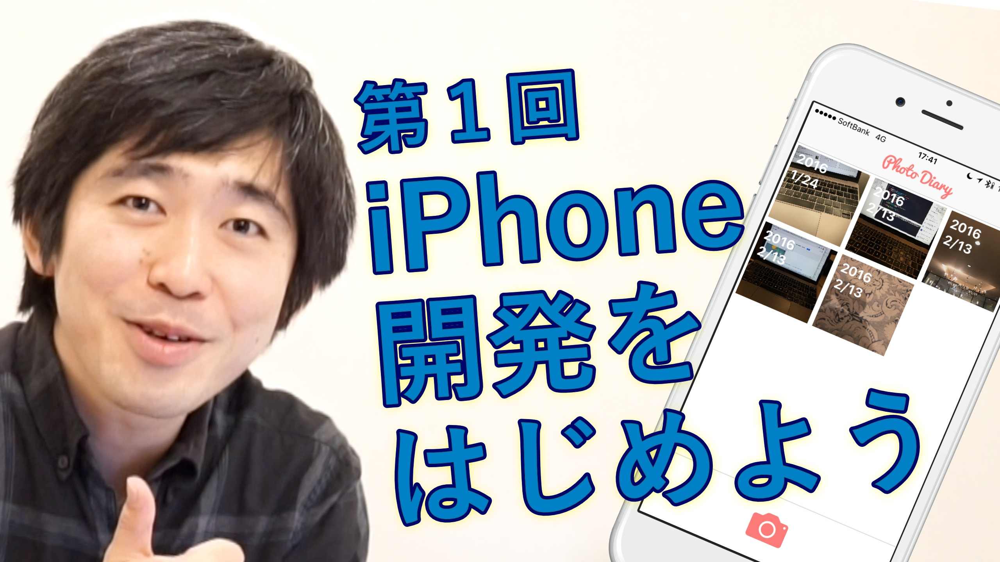

# 森田先生のiPhone開発教室 全13回 サンプルコード

## サンプルコード

YouTube動画 [森田先生のiPhone開発教室 全13回](https://www.youtube.com/playlist?list=PL6kPaLFdwqq6b0jV0CkaVpW37oKKFOxkt) のサンプルコードです。そのまま見ても良いですし、[こちら](https://github.com/morizotter/PhotoDiary/archive/master.zip)からダウンロードしてお手元で動かして確認することもできます。

## 森田先生のiPhone開発教室

[森田先生のiPhone開発教室 全13回](https://www.youtube.com/playlist?list=PL6kPaLFdwqq6b0jV0CkaVpW37oKKFOxkt) はプログラミングが初めての人でも、真似するだけで体験できるiPhoneアプリ開発の導入動画シリーズです。気楽な感じで見てみてください。

## 関連情報

- 出演: [@morizotter](https://twitter.com/morizotter)
- 撮影・編集: [@imaimiami](https://twitter.com/imaimiami)
